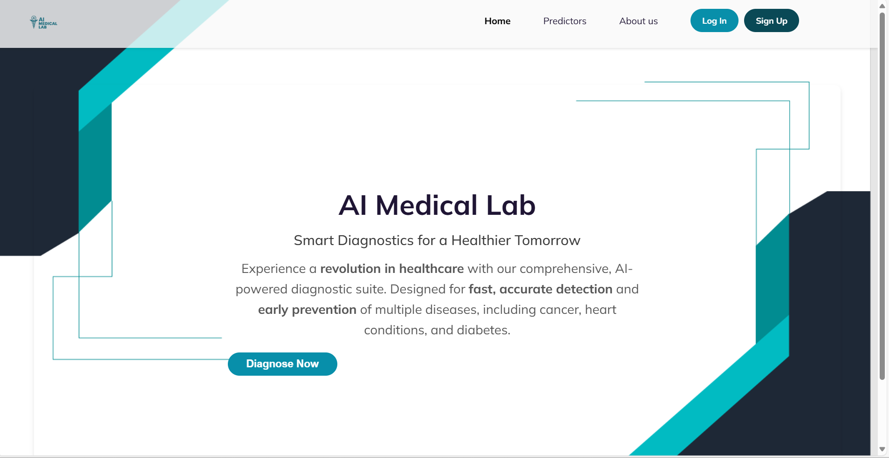
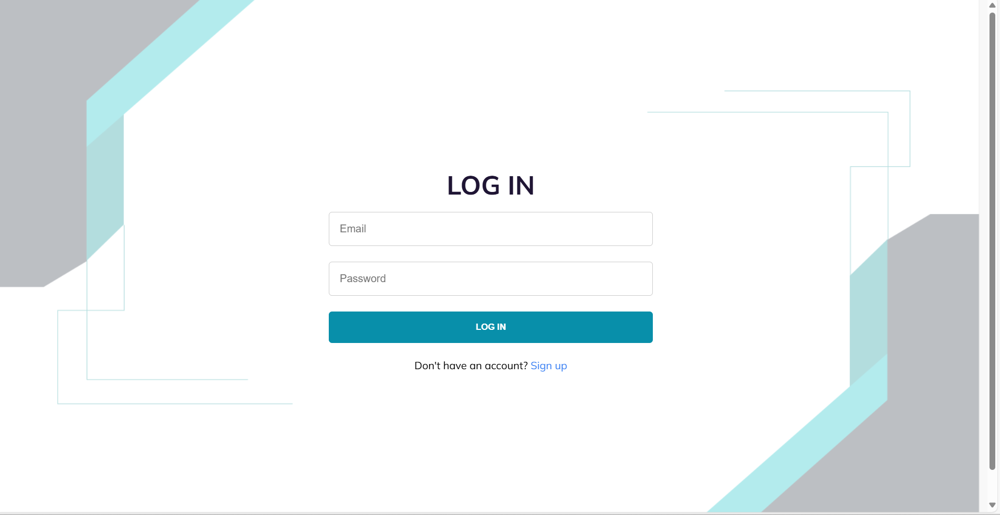
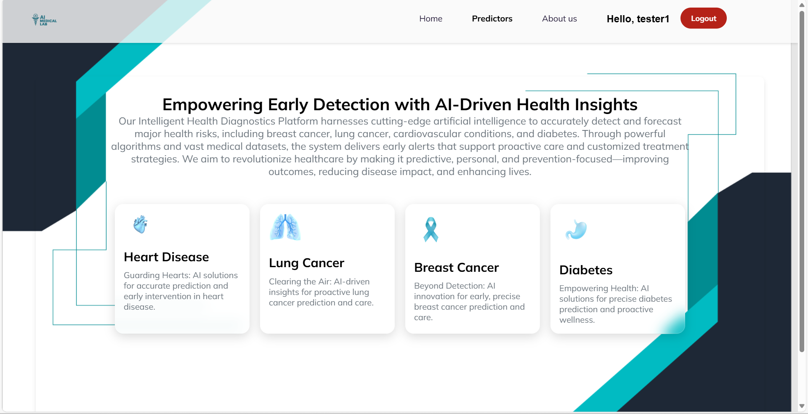

# TambuaHealth  
**AI-powered multi-disease prediction system**  

  

TambuaHealth is a powerful diagnostic platform that helps detect heart disease, diabetes, breast cancer, and lung cancer using patient medical data and imagery. It’s designed with simplicity and accessibility in mind, especially for under-resourced healthcare settings. With the power of machine learning and a clean, user-friendly interface, TambuaHealth brings faster, scalable, and smarter diagnosis to the forefront of modern care.

---

## 📚 Table of Contents  
- [✨ Key Features](#-key-features)  
- [🛠️ Tech Stack](#-tech-stack)  
- [🧠 Disease Prediction Models](#-disease-prediction-models)  
- [⚙️ How It Works](#️-how-it-works)  
- [📁 File Structure](#-file-structure)  
- [📸 Screenshots](#-screenshots)  
- [🚀 Future Roadmap](#-future-roadmap)  
- [📜 License](#-license)  

---

## ✨ Key Features  

### 🛡️ Secure Access  
- **User Authentication:** Secured registration and Login Pages. 

### 🔍 Multi-Modal Prediction  
- Manual entry or prescription scan with **regex auto-fill**  
- Medical image upload (X-ray, CT, MRI) for deep learning inference  

### 📊 Clinical Tools  
- Instant AI-generated reports in downloadable **PDF format**  
- Real-time feedback via **React Toast notifications**  
- All models execute directly in the backend (Node.js only — no Flask!)  

---

## 🛠️ Tech Stack  

### 💻 Frontend  
- React (Vite) + Context API  
- Tailwind CSS  
- React Leaflet *(for future geolocation analytics)*  
- React Toastify *(notification system)*  

### 🧪 Backend  
- Node.js + Express  
- MongoDB (Atlas or Local)  
- Cloudinary (image storage)  
- Node.js Child Process (to call Python ML models)  

### 🤖 Machine Learning  
- **Heart Disease**: Logistic Regression  
- **Diabetes**: Support Vector Machine (SVM)  
- **Breast Cancer**: CNN  
- **Lung Cancer**: InceptionResNet  
- All models trained in Python and executed via backend integration  

---

## 🧠 Disease Prediction Models  
-----------------------------------------------------------------------------------------------
| Condition         | Model               | Input Type          | Key Features Scanned        |  
|-------------------|---------------------|---------------------|-----------------------------|  
| **Heart Disease** | Logistic Regression | Form/Prescription   | Age, cholesterol, BP, etc.  |  
| **Diabetes**      | SVM                 | Form/Prescription   | Glucose, BMI, insulin, etc. |  
| **Breast Cancer** | CNN                 | Image Upload        | Tumor shape and patterns    |  
| **Lung Cancer**   | InceptionResNet     | Image Upload        | Nodule and anomaly detection|  
-----------------------------------------------------------------------------------------------
---

## ⚙️ How It Works  

1. 🔐 **Welcome Page**: The Welcome Page as the landing point for user authentication and access to the prediction models.  
   

2. 🔐 **Login**: Doctor or patient signs in securely  
   

3. 🧪 **Choose Test**: Select the disease model  
   

4. 📝 **Input Data**:  
   - Fill a form manually **OR**  
   - Upload prescription *(auto-filled via regex)*  
   - Upload image for cancer detection  
     
     
   

5. ⚡ **Get Results**: View instant predictions + explanation  
   ! Results are generated and displayed for user review

6. 📄 **Download Report**: Generate a PDF diagnosis summary  
   ! Download your results as a PDF for your records.

```bash
# Quick start guide
cd Backend && npm install && npm run server
cd Frontend && npm install && npm run dev
```