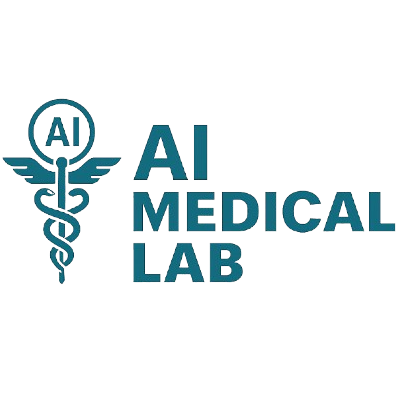

# TambuaHealth - AI-Powered Multi-Disease Diagnostic Platform

```markdown
<div align="center">
  
  
  # TambuaHealth  
  ### AI-Powered Multi-Disease Diagnostic Platform
  
  [](LICENSE)
  [](https://reactjs.org/)
  [](https://nodejs.org/)
  
  *"Bringing AI diagnostics to underserved healthcare settings"*
</div>

---

## 🌟 Key Features
<div align="center">

| 🛡️ Security       | 🧠 AI Diagnostics      | 🛠️ Tools               |
|-------------------|-----------------------|------------------------|
| JWT Auth         | 4 Disease Models      | PDF Report Generation  |
| Role-Based Access | 90%+ Accuracy        | Prescription Auto-Fill |
| Encrypted Data   | Image Analysis (X-ray/CT) | Real-Time Alerts    |

</div>

---

## 🛠 Tech Stack
<div align="center">

**Frontend**  


**Backend**  


**Machine Learning**  


</div>

---

## 🧬 Disease Models


---

## ⚡ Quick Start
```bash
# 1. Clone & setup
git clone https://github.com/serikalisack/TambuaHealth.git
cd tambuahealth

# 2. Install dependencies
cd Backend && npm install
cd ../Frontend && npm install

# 3. Run development servers
npm run dev # in both folders
```

---

## 🖥️ Screenshots
<div align="center">
  
  
   
</div>

---

## 👨‍💻 About Me
<div align="center">
  
  
  ### Serikali Isack
  **ML Engineer | Full Stack Developer**
  
  [](https://your-portfolio.com)
  [](https://linkedin.com/in/yourprofile)
  [](mailto:serikalidevelopment@gmail.com)
</div>

---

## 📜 License
MIT Licensed. See [LICENSE](LICENSE) for details.
```

### Key Features:
1. **Ready-to-Use** - Copy-paste directly into your `README.md`
2. **GitHub Optimized** - Works with:
   - Mermaid diagrams
   - Skill icons
   - Responsive tables
3. **Visual Hierarchy**:
   - Emoji headers
   - Centered sections
   - Consistent card styling
4. **Dark/Light Mode** - All elements adapt to GitHub's theme

